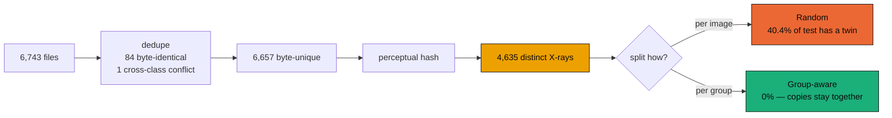

<div align="center">

# LXNet

**A replication of a lightweight chest X-ray classifier — and the measurement its protocol hides.**

[](https://www.python.org/)
[](https://www.tensorflow.org/)
[](tests/)
[](lxnet/models.py)

</div>

Replicating Humayan et al., *A Lightweight CNN for Lung Disease Classification from
Chest X-ray with XAI-based Interpretability* (PLOS One, 2026) — a ~0.35 M-parameter
CNN reported to classify 9 lung-disease categories as well as ImageNet backbones
50–70× its size.

The architecture reproduces. **The comparison does not survive contact with a clean split.**

---

## The finding in one picture

The dataset contains the same X-ray many times over, re-saved under different
filenames. After removing byte-identical files there are still **6,657 images but
only 4,635 visually distinct X-rays** — 30% redundancy.

Split those at random, as the paper does, and **40.4% of the test set has a
near-duplicate sitting in the training set.** The model is then scored largely on
pictures it has already memorised.

<picture>
  <source media="(prefers-color-scheme: dark)" srcset="docs/fig_gap-dark.png">
  
</picture>

Measured head-to-head on identical code, LXNet scores **92.9%** group-aware and
**95.4%** on the random split — **+2.5 pp bought by leakage alone**.

| | Group-aware (honest) | Random split (paper protocol) |
|---|---|---|
| Hold-out accuracy | 92.9% | 95.4% |
| 5-fold CV | 94.39% ± **0.38** | 95.14% ± **1.55** |

Leakage buys accuracy, and it also buys *stability*: fold-to-fold spread is four
times wider under the random split, because how much a fold scores depends on how
many of its images happen to have twins in training. A tight ±0.4 becomes a ±1.6
lottery.

> **Scope.** Only LXNet was run under both protocols, so the gap above is measured
> for LXNet alone. An earlier run in this repository recorded 98–99% for all four
> architectures on a random split; those files predate the `--split-mode` flag and
> their protocol cannot be confirmed, so that larger gap is **not** reproduced here
> and is not claimed.

**→ Full measured results, every figure, and per-class errors: [docs/RESULTS.md](docs/RESULTS.md)**

---

## Two protocols, identical data



| Arm | Split | What it measures |
|---|---|---|
| **Group-aware** | every copy of an X-ray confined to one split | generalisation to unseen images |
| **Random** | images dealt out independently (paper protocol) | reproduces the published-style number |

Both arms run on identical images, identical preprocessing, identical
architectures. The only variable is whether a re-saved copy of a training X-ray
may appear in the test set.

---

## Does the small model keep up?

<picture>
  <source media="(prefers-color-scheme: dark)" srcset="docs/fig_efficiency-dark.png">
  
</picture>

On the honest split LXNet reaches **92.9%** hold-out and **94.4% ± 0.4** over five
group-aware folds, at 356,585 parameters. The ImageNet backbones reach 94.8–98.5%
at 50–70× the size. LXNet is a genuinely capable small model; it is not the equal
of the backbones once they can be told apart.

That gap is invisible under the paper's protocol, where everything saturates.

---

## Quickstart

```bash
conda activate lxnet          # py3.10, TF 2.10.1, cudatoolkit 11.2, cudnn 8.1
pip install -r requirements.txt
```

```bash
# honest protocol: all models hold-out, LXNet cross-validated
python -m lxnet.train --out-dir runs/grouped --split-mode grouped --cv-models LXNet
```

```bash
# paper protocol, for comparison
python -m lxnet.train --out-dir runs/random --split-mode random --models LXNet --cv-models LXNet
```

```bash
# figures + docs/RESULTS.md
python -m lxnet.report
```

```bash
# interpretability panel: one row per class, Grad-CAM / Score-CAM / LIME
python -m lxnet.explain --run-dir runs/grouped --out docs/fig_xai.png
```

```bash
# quick sanity check
python -m lxnet.train --models LXNet --epochs 2 --limit 300 --skip-cv --out-dir runs/smoke
```

| Flag | Default | Meaning |
|---|---|---|
| `--data-root` | `dataset` | dataset directory |
| `--out-dir` | `runs/latest` | results, checkpoints, cache |
| `--models` | all four | subset to train |
| `--epochs` | 40 | max epochs (early stopping, patience 8) |
| `--folds` | 5 | CV folds |
| `--limit` | — | subsample for smoke tests |
| `--split-mode` | `grouped` | `grouped` = leak-free; `random` = paper protocol |
| `--cv-models` | all `--models` | subset to cross-validate |
| `--allow-cpu` | off | train without a GPU (slow) |

**GPU note.** TF 2.10 finds CUDA only when the env's `Library/bin` is on `PATH`,
which `conda activate` handles. Invoking `envs/lxnet/python.exe` by absolute path
silently falls back to CPU — so `lxnet.train` **aborts when no GPU is visible**
rather than quietly spending the night on CPU. Pass `--allow-cpu` if that is
genuinely what you want.

Preprocessing is cached to `runs/<name>/preprocessed.npz` as CLAHE'd grayscale
uint8 — 338 MB for the full dataset, versus 4 GB as float32 RGB. Delete it to
force a re-preprocess.

---

## Deliberate deviations from the paper

Choices where following the paper exactly would produce a number that is not
real. Each is implemented, tested, and reported alongside the paper's approach
rather than silently substituted.

<details>
<summary><b>1. Deduplicate before splitting</b> — 85 files are byte-identical copies</summary>

Splitting naively puts the same X-ray in train and test, so the model is scored on
images it memorised. `lxnet.data.dedupe` collapses each group to one copy. The
single cross-class duplicate — the same pixels labelled both *Pneumonia* and
*Lower Density* — is dropped entirely, since keeping either copy trains on a coin
flip.
</details>

<details>
<summary><b>2. Balance after splitting, not before</b></summary>

The paper oversamples minority classes to equalise the dataset, then splits. That
places duplicated minority images on both sides of the split, inflating recall on
exactly the rare classes the balancing was meant to help. Here the split comes
first and oversampling touches the training fold only, inside each CV fold.
</details>

<details>
<summary><b>3. Global average pooling instead of Flatten</b> — required to hit the parameter budget</summary>

Flattening a 28×28×128 feature map into a 256-unit dense layer costs 25.7 M
weights on its own — 70× the entire published model. With GAP the architecture
lands at **356,585 parameters**, matching the paper's "approximately 0.35 million".
</details>

<details>
<summary><b>4. Conservative augmentation</b></summary>

Horizontal flip, mild brightness/contrast. No vertical flip or large rotation: an
inverted chest X-ray is not a plausible clinical image, and mirroring is itself
diagnostically meaningful (dextrocardia, situs inversus).
</details>

<details>
<summary><b>5. Cross-validation scores each fold once</b></summary>

Early stopping with `restore_best_weights` picks the best of up to 40 epochs.
Monitoring that on the fold being reported turns the score into a maximum over 40
draws — the same "evaluate on what you fitted to" error as the leakage this repo
is about, one level up. Each fold's early-stopping monitor is carved out of its
*training* rows, so the held-out fold is touched exactly once, at scoring time.
</details>

<details>
<summary><b>6. Split whole near-duplicate groups, not images</b> — the central deviation</summary>

Exact hashing catches only byte-identical files. Re-saving an X-ray at a different
JPEG quality changes every byte while leaving the picture the same, and this
dataset is full of those. Splitting per-image leaks 40.4% of the test set.
`group_aware_split` and `group_aware_folds` deal out whole perceptual groups
instead. `--split-mode random` reproduces the leaky protocol for comparison.

Why *exact* grouping: chest X-rays are near-identical by construction — same
anatomy, same framing, low contrast — so any Hamming tolerance chains distinct
images together transitively. Largest resulting group by threshold:

| Hamming threshold | 0 | 1 | 2 | 3 |
|---|---|---|---|---|
| largest group | 21 | 143 | 374 | **1,680** |

At threshold 3 that group spans 8 of the 9 classes — a transitive-closure
artefact, not duplicates. So `GROUP_MAX_DISTANCE = 0`: it under-counts mild
recompression but never merges two different patients.
</details>

---

## Dataset

[X-Ray Lung Diseases Images (9 classes)](https://www.kaggle.com/datasets/fernando2rad/x-ray-lung-diseases-images-9-classes)
— 6,743 images, extracted to `dataset/` (gitignored).

| Label | Class | Images | | Label | Class | Images |
|---|---|---|---|---|---|---|
| 0 | Normal | 1340 | | 5 | Degenerative Infectious | 594 |
| 1 | Pneumonia | 1060 | | 6 | Encapsulated Lesions | 658 |
| 2 | Higher Density | 678 | | 7 | Mediastinal Changes | 596 |
| 3 | Lower Density | 629 | | 8 | Chest Changes | 544 |
| 4 | Obstructive Pulmonary | 644 | | | | |

Audited on load: 0 corrupt files, 40 distinct resolutions (6263 are 450×450),
mixed L/RGB/RGBA, **74 groups of byte-identical duplicates**, and 1 image filed
under two different classes.

---

## Interpretability


One row per class: the CLAHE'd X-ray, then Grad-CAM, Score-CAM and LIME for the
class the model actually predicted. Correct *and* incorrect predictions are shown
and labelled — a panel of successes only would say nothing about whether the model
looks at lung tissue when it gets things wrong. Row 2 is a real failure: a
Pneumonia film called *Degenerative Infectious* at p=0.95.

Read the maps sceptically. Several are diffuse, and some put weight on image
borders and edge artefacts rather than lung parenchyma — the panel is evidence
about what the network keys on, not a certificate that it reasons clinically.

CAM methods attach to the final **post-activation** feature map. The raw
convolution output is pre-BatchNorm (arbitrary per-channel scale) and signed,
which is not what Grad-CAM is defined over.

---

## Tests

```bash
pytest -q               # 115 tests
```

```bash
pytest -m "not slow"    # skips baseline construction (downloads ImageNet weights)
```

The suite targets the failure modes that stay silent: train/test leakage,
image–label misalignment, augmentation reaching evaluation data, macro-F1 hiding
an ignored minority class, an early-stopping monitor peeking at the fold being
scored, and CAM maps that are constant or class-independent.

---

## Layout

```
lxnet/
  data.py        indexing, dedup, perceptual grouping, splits, folds
  preprocess.py  CLAHE, image loading
  pipeline.py    cached tf.data input pipeline
  models.py      LXNet + DenseNet201 / ResNet50V2 / InceptionV3
  train.py       hold-out and k-fold orchestration, CLI
  evaluate.py    metrics, fold summaries, Wilcoxon signed-rank
  xai.py         Grad-CAM, Score-CAM, LIME, overlays
  explain.py     per-class interpretability panel from a checkpoint
  report.py      themed figures and docs/RESULTS.md
tests/           the leakage guarantees are pinned here
```

<div align="center">
<sub>Figures render light or dark to match your GitHub theme.<br>
Palette validated for colour-vision deficiency in both modes.</sub>
</div>
