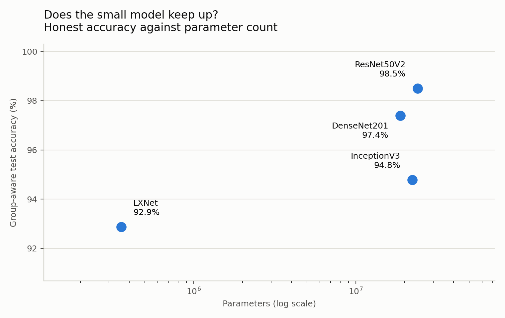
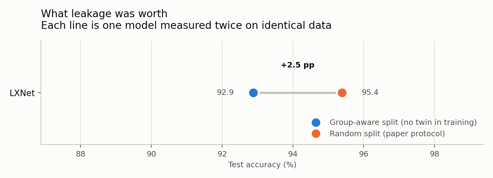
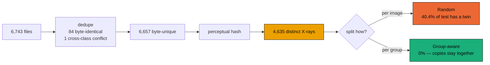
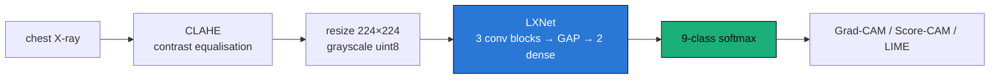
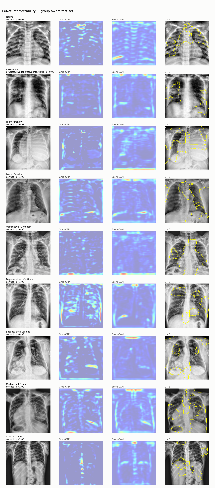

<div align="center">

# LXNet

### Lung disease classification from chest X-rays — nine classes, 0.35 M parameters, honestly measured.

[](https://github.com/baveshraam/LXNet/actions/workflows/ci.yml)
[](https://www.python.org/)
[](https://www.tensorflow.org/)
[](tests/)
[](docs/MODEL_CARD.md)
[](docs/report/LXNet_Technical_Report.pdf)

**[Results](docs/RESULTS.md) · [Model card](docs/MODEL_CARD.md) · [Technical report](docs/report/LXNet_Technical_Report.pdf) · [Quickstart](#quickstart)**

</div>

---

A compact convolutional classifier for chest radiographs, trained end-to-end and
shipped with the thing most X-ray models omit: **an evaluation you can trust.**

The dataset this system trains on contains the same X-ray many times over,
re-saved under different filenames. Split it naively and 40% of your test set is
already in your training set — every model scores 98–99% and the numbers mean
nothing. LXNet ships a near-duplicate–aware split, so the reported accuracy is
accuracy on images the model has genuinely never seen.

```bash
pip install -e .
lxnet-predict chest_xray.jpg
```

```
  Pneumonia                  0.949
  Normal                     0.041
  Encapsulated Lesions       0.010
```

Real output on a held-out pneumonia film. It does not always land — the file
immediately before this one in the same folder returns *Encapsulated Lesions* at
0.796, which is what a 73% recall looks like from the inside.

---

## What it does

Classifies a chest radiograph into one of nine categories:

| | | |
|---|---|---|
| Normal | Pneumonia | Higher Density *(effusion, consolidation)* |
| Lower Density *(pneumothorax)* | Obstructive Pulmonary *(emphysema)* | Degenerative Infectious *(TB, fibrosis)* |
| Encapsulated Lesions *(nodules, masses)* | Mediastinal Changes | Chest Changes *(atelectasis)* |

**356,585 parameters** — small enough to run on CPU, a phone, or an edge box in a
clinic without a GPU.

> ⚠️ **Not a medical device.** Research and educational use only. Recall on
> Pneumonia is 73%, meaning roughly one in four pneumonia films is missed. Read the
> [model card](docs/MODEL_CARD.md) before doing anything with this.

---

## Measured performance

Held-out test set, near-duplicate–aware split, images the model has never seen:

<picture>
  <source media="(prefers-color-scheme: dark)" srcset="docs/fig_efficiency-dark.png">
  
</picture>

| Model | Params | Accuracy | Macro-F1 | Accuracy per M params |
|---|---|---|---|---|
| ResNet50V2 | 24.1 M | **98.50%** | 0.9885 | 4.1 |
| DenseNet201 | 18.8 M | 97.39% | 0.9797 | 5.2 |
| InceptionV3 | 22.3 M | 94.78% | 0.9534 | 4.2 |
| **LXNet** | **0.36 M** | 92.88% | 0.9382 | **260.5** |

LXNet, cross-validated over five near-duplicate–aware folds: **94.39% ± 0.38**.

The trade is explicit. LXNet gives up **5.6 points** of accuracy to the best
backbone and returns **63× the accuracy per parameter**. Which side of that trade
you want depends on whether you are deploying to a datacentre or a clinic.

**[→ Full results: every metric, per-class errors, confusion matrices](docs/RESULTS.md)**

---

## Why the split matters

<picture>
  <source media="(prefers-color-scheme: dark)" srcset="docs/fig_gap-dark.png">
  
</picture>



6,657 byte-unique files reduce to **4,635 visually distinct X-rays** — 30% of the
corpus is the same image re-saved. Measured head-to-head on identical code:

| | Group-aware | Random split |
|---|---|---|
| Hold-out accuracy | 92.9% | 95.4% |
| 5-fold CV | 94.39% ± **0.38** | 95.14% ± **1.55** |

Leakage buys accuracy, and it also buys *stability*: fold spread is four times
wider under the random split, because how much a fold scores depends on how many
of its images happen to have twins in training.

`--split-mode random` reproduces the leaky protocol if you want to see it yourself.

---

## Quickstart

```bash
pip install -e .
```

**Predict on an image:**

```bash
lxnet-predict chest_xray.jpg --checkpoint runs/grouped/checkpoints/LXNet_holdout.weights.h5
```

```bash
lxnet-predict chest_xray.jpg --json          # machine-readable
```

**Train from scratch:**

```bash
lxnet-train --out-dir runs/grouped --split-mode grouped --cv-models LXNet
```

**Rebuild the report:**

```bash
lxnet-report
```

<details>
<summary>All training flags</summary>

| Flag | Default | Meaning |
|---|---|---|
| `--data-root` | `dataset` | dataset directory |
| `--out-dir` | `runs/latest` | results, checkpoints, cache |
| `--models` | all four | subset to train |
| `--epochs` | 40 | max epochs (early stopping, patience 8) |
| `--folds` | 5 | CV folds |
| `--limit` | — | subsample for smoke tests |
| `--split-mode` | `grouped` | `grouped` = leak-free; `random` = leaky protocol |
| `--cv-models` | all `--models` | subset to cross-validate |
| `--allow-cpu` | off | train without a GPU (slow) |

**GPU note.** TF 2.10 finds CUDA only when the env's `Library/bin` is on `PATH`,
which `conda activate` handles. Invoking `python.exe` by absolute path silently
falls back to CPU — so training **aborts when no GPU is visible** rather than
quietly spending the night on CPU. Pass `--allow-cpu` if that is what you want.

Preprocessing is cached to `runs/<name>/preprocessed.npz` as CLAHE'd grayscale
uint8 — 338 MB, versus 4 GB as float32 RGB. Delete it to force a re-preprocess.

</details>

---

## How it works



**CLAHE** equalises local contrast, which matters on radiographs where the
diagnostic signal sits in a narrow band of greys. Applied once and cached, not
per-epoch — it is far too slow to repeat.

**Global average pooling instead of Flatten.** Flattening a 28×28×128 feature map
into a 256-unit dense layer costs 25.7 M weights on its own — 70× the entire
model. GAP lands the architecture at 356,585 parameters.

**Conservative augmentation.** Horizontal flip, mild brightness and contrast. No
vertical flip or large rotation: an inverted chest X-ray is not a plausible
clinical image, and mirroring is itself diagnostically meaningful (dextrocardia,
situs inversus).

---

## Interpretability

Every prediction can be explained three ways:

```bash
lxnet-explain --run-dir runs/grouped --out docs/fig_xai.png
```



One row per class: the CLAHE'd X-ray, then Grad-CAM, Score-CAM and LIME for the
class the model actually predicted. Correct *and* incorrect predictions are shown
and labelled — row 2 is a real failure, a Pneumonia film called *Degenerative
Infectious* at p=0.95.

Read the maps sceptically. Several are diffuse, and some put weight on image
borders and edge artefacts rather than lung parenchyma. The panel is evidence
about what the network keys on, not a certificate that it reasons clinically.

CAM methods attach to the final **post-activation** feature map. The raw
convolution output is pre-BatchNorm (arbitrary per-channel scale) and signed,
which is not what Grad-CAM is defined over.

---

## Engineering

<details>
<summary><b>Evaluation integrity</b> — the guarantees this project exists to hold</summary>

**Deduplicate before splitting.** 85 files are byte-identical copies. The single
cross-class duplicate — the same pixels labelled both *Pneumonia* and *Lower
Density* — is dropped entirely, since keeping either copy trains on a coin flip.

**Balance after splitting, not before.** Oversampling the whole dataset and then
splitting places duplicated minority images on both sides, inflating recall on
exactly the rare classes balancing was meant to help. The split comes first;
oversampling touches the training fold only.

**Cross-validation scores each fold once.** Early stopping with
`restore_best_weights` picks the best of up to 40 epochs. Monitoring that on the
fold being reported turns the score into a maximum over 40 draws. Each fold's
monitor is carved out of its *training* rows, so the held-out fold is touched
exactly once, at scoring time.

**Split whole near-duplicate groups.** Exact hashing catches only byte-identical
files; re-saving at a different JPEG quality changes every byte while leaving the
picture the same. Group-aware splits deal out whole perceptual groups.

Why *exact* perceptual grouping: chest X-rays are near-identical by construction,
so any Hamming tolerance chains distinct images together transitively.

| Hamming threshold | 0 | 1 | 2 | 3 |
|---|---|---|---|---|
| largest group | 21 | 143 | 374 | **1,680** |

At threshold 3 that group spans 8 of the 9 classes — a transitive-closure
artefact, not duplicates.

</details>

<details>
<summary><b>Testing</b> — 133 tests, targeting the failures that stay silent</summary>

```bash
pytest                  # everything
pytest -m "not slow"    # skips ImageNet weight downloads
```

The suite pins the failure modes that produce a *plausible* wrong number rather
than a crash: train/test leakage, image–label misalignment, augmentation reaching
evaluation data, macro-F1 hiding an ignored minority class, an early-stopping
monitor peeking at the fold being scored, CAM maps that are constant or
class-independent, and inference preprocessing drifting from training
preprocessing.

</details>

<details>
<summary><b>Dataset</b></summary>

[X-Ray Lung Diseases Images (9 classes)](https://www.kaggle.com/datasets/fernando2rad/x-ray-lung-diseases-images-9-classes)
— 6,743 images, extracted to `dataset/` (gitignored).

| Label | Class | Images | | Label | Class | Images |
|---|---|---|---|---|---|---|
| 0 | Normal | 1340 | | 5 | Degenerative Infectious | 594 |
| 1 | Pneumonia | 1060 | | 6 | Encapsulated Lesions | 658 |
| 2 | Higher Density | 678 | | 7 | Mediastinal Changes | 596 |
| 3 | Lower Density | 629 | | 8 | Chest Changes | 544 |
| 4 | Obstructive Pulmonary | 644 | | | | |

Audited on load: 0 corrupt files, 40 distinct resolutions (6,263 are 450×450),
mixed L/RGB/RGBA, 74 groups of byte-identical duplicates, 1 image filed under two
different classes.

</details>

---

## Layout

```
lxnet/
  data.py        indexing, dedup, perceptual grouping, splits, folds
  preprocess.py  CLAHE, image loading
  pipeline.py    cached tf.data input pipeline
  models.py      LXNet + DenseNet201 / ResNet50V2 / InceptionV3
  train.py       hold-out and k-fold orchestration
  predict.py     inference: validation, preprocessing, ranked probabilities
  evaluate.py    metrics, fold summaries, Wilcoxon signed-rank
  xai.py         Grad-CAM, Score-CAM, LIME, overlays
  explain.py     per-class interpretability panel
  report.py      themed figures and docs/RESULTS.md
docs/            results, model card, figures
tests/           the evaluation guarantees are pinned here
```

---

<div align="center">
<sub>Architecture and evaluation protocol follow Humayan et al., <i>A Lightweight CNN for Lung
Disease Classification from Chest X-ray with XAI-based Interpretability</i>, PLOS One 2026,
with the deviations documented in <a href="docs/RESULTS.md">Results</a>.</sub>
<br><br>
<sub>Figures render light or dark to match your theme. Palette validated for colour-vision deficiency in both modes.</sub>
</div>
