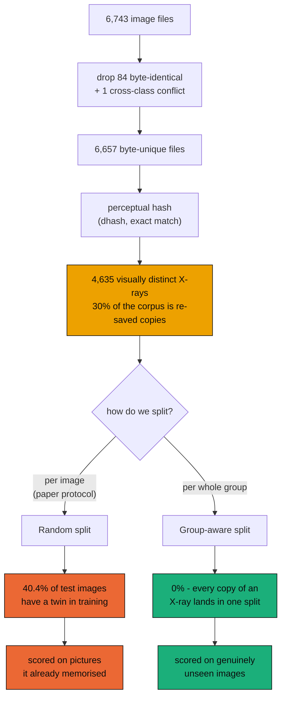
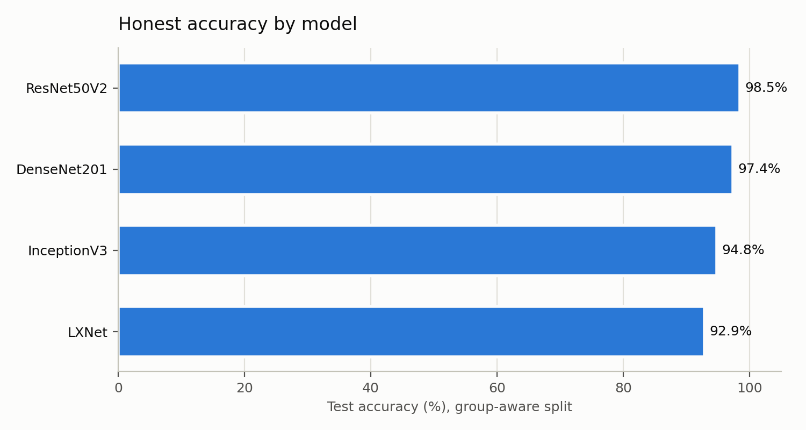
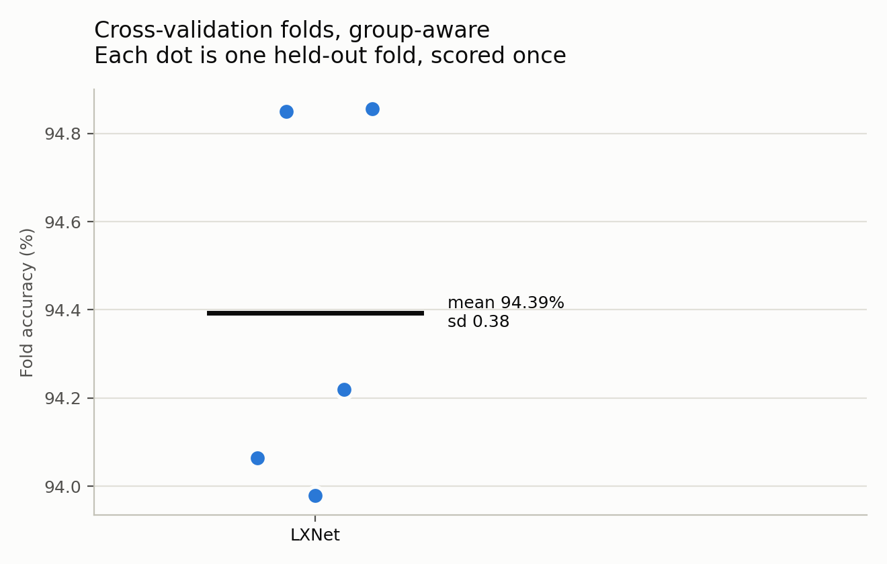
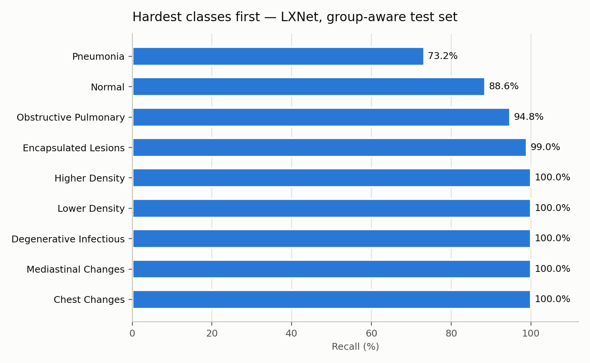
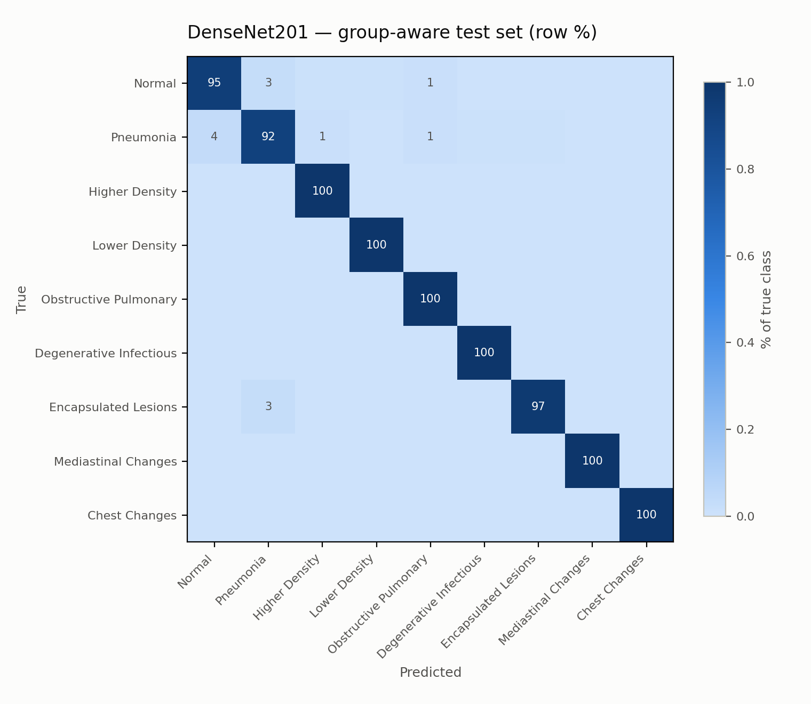
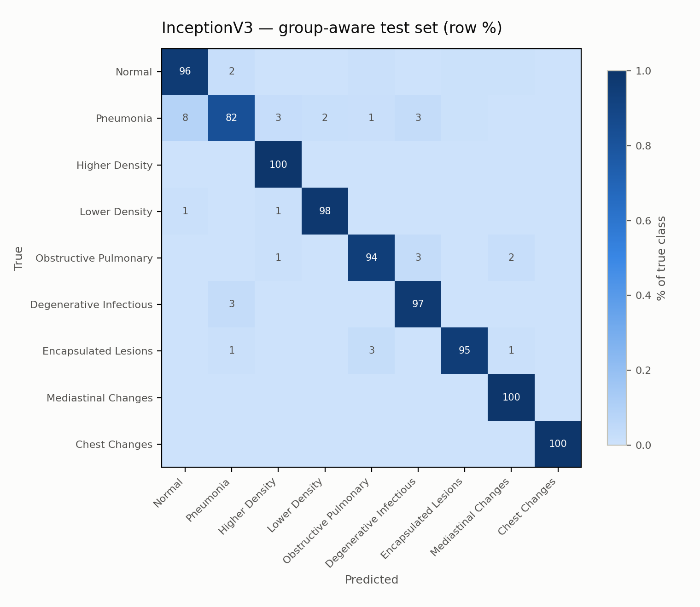
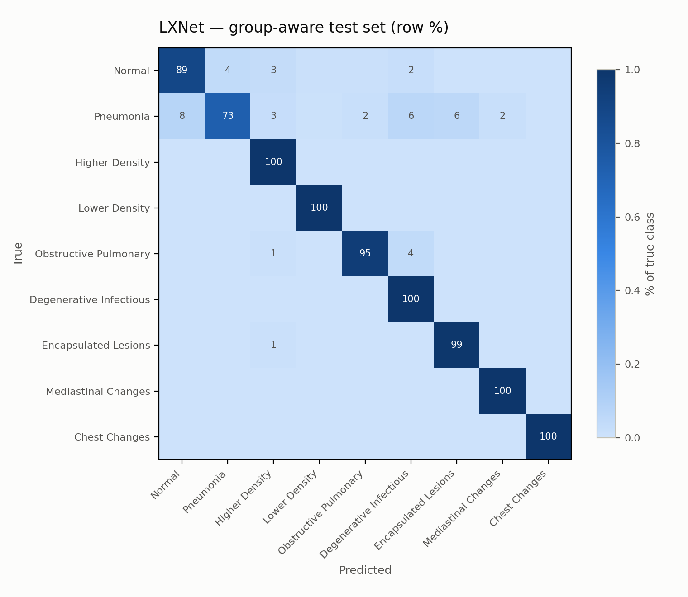
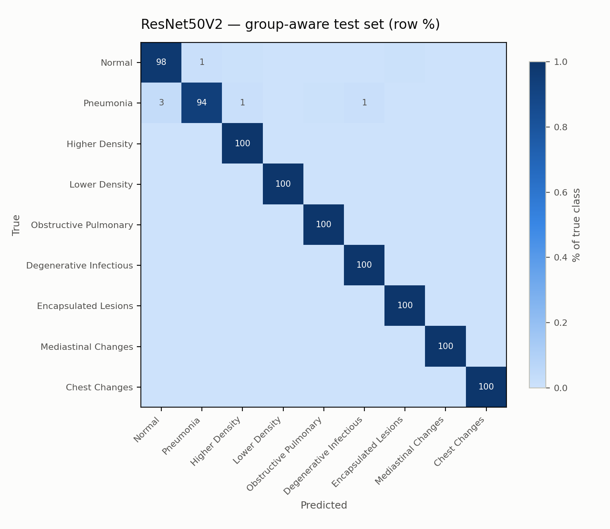
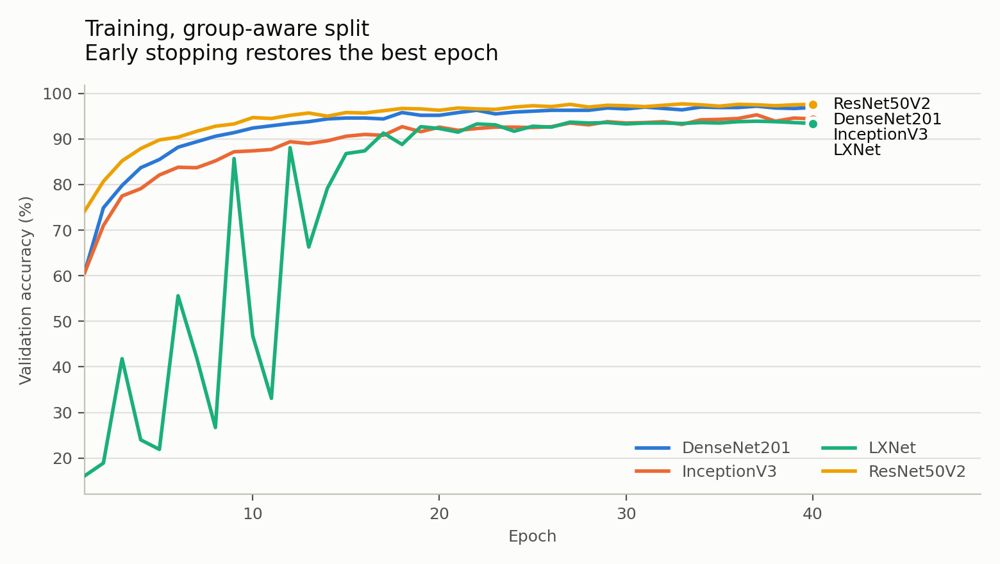

# Results

> A replication of Humayan et al. (PLOS One, 2026) that reports the number the paper's protocol hides.

<table>
<tr>
<td align="center"><h2>40.4%</h2>test set with a<br>training twin<br><sub>random split</sub></td>
<td align="center"><h2>+2.5 pp</h2>accuracy LXNet gains<br>from that leakage<br><sub>same data, same model</sub></td>
<td align="center"><h2>5.6 pp</h2>LXNet trails the best<br>backbone once it is gone<br><sub>group-aware hold-out</sub></td>
<td align="center"><h2>6,657</h2>byte-unique files<br>&rarr; 4,635 distinct X-rays<br><sub>30% redundancy</sub></td>
</tr>
</table>

---

## The finding

Under a random split 40.4% of test images have a near-duplicate in the training set; under the group-aware split, none do. LXNet scores 92.9% on the group-aware test set, against 95.4% on the random split (+2.5 pp of leakage). The strongest model overall is ResNet50V2 at 98.5%.

<picture>
  <source media="(prefers-color-scheme: dark)" srcset="fig_gap-dark.png">
  
</picture>

Both arms run on identical images, identical preprocessing and identical architectures. The only thing that changes is whether a re-saved copy of a training X-ray is allowed to appear in the test set.

## How the two protocols differ



Grouping uses exact perceptual-hash equality. Chest X-rays are near-identical by construction, so any Hamming tolerance chains distinct images together transitively — at threshold 3 the largest group reaches 1,680 images spanning 8 of 9 classes. Exact equality under-counts mild recompression but never merges two different patients.

## Hold-out comparison

| Model | Params | Group-aware acc. (%) | Group-aware F1 | Random-split acc. (%) | Inflation (pp) |
|---|---|---|---|---|---|
| ResNet50V2 | 24.09 M | 98.5 | 0.988 | — | — |
| DenseNet201 | 18.82 M | 97.4 | 0.980 | — | — |
| InceptionV3 | 22.33 M | 94.8 | 0.953 | — | — |
| LXNet | 357 K | 92.9 | 0.938 | 95.4 | +2.5 |

### Does the small model keep up?

The paper's central claim is that ~0.35 M parameters match backbones 50–70× larger. That claim is only testable on a split where the models can actually be told apart.

<picture>
  <source media="(prefers-color-scheme: dark)" srcset="fig_efficiency-dark.png">
  
</picture>

<picture>
  <source media="(prefers-color-scheme: dark)" srcset="fig_accuracy_by_model-dark.png">
  
</picture>

## Cross-validation

<picture>
  <source media="(prefers-color-scheme: dark)" srcset="fig_cv_folds-dark.png">
  
</picture>

| Model | Folds | Accuracy (%) | Macro-F1 |
|---|---|---|---|
| LXNet | 5 | 94.39 ± 0.38 | 0.9504 |

Each fold's early-stopping monitor is carved out of that fold's *training* rows, so the reported fold is touched exactly once, at scoring time.

## Where the errors are

<picture>
  <source media="(prefers-color-scheme: dark)" srcset="fig_per_class-dark.png">
  
</picture>

### DenseNet201

<picture>
  <source media="(prefers-color-scheme: dark)" srcset="fig_confusion_DenseNet201-dark.png">
  
</picture>

### InceptionV3

<picture>
  <source media="(prefers-color-scheme: dark)" srcset="fig_confusion_InceptionV3-dark.png">
  
</picture>

### LXNet

<picture>
  <source media="(prefers-color-scheme: dark)" srcset="fig_confusion_LXNet-dark.png">
  
</picture>

### ResNet50V2

<picture>
  <source media="(prefers-color-scheme: dark)" srcset="fig_confusion_ResNet50V2-dark.png">
  
</picture>

## Training

<picture>
  <source media="(prefers-color-scheme: dark)" srcset="fig_training-dark.png">
  
</picture>

## Dataset after cleaning

- images indexed: 6,741
- byte-identical duplicates removed: 84
- cross-class label conflicts removed: 1
- split (train/val/test): 4660/1000/997
- random-split test images with a training twin: 40.4%

## Reproducing

```bash
python -m lxnet.train --out-dir runs/grouped --split-mode grouped --cv-models LXNet
python -m lxnet.train --out-dir runs/random --split-mode random --models LXNet --cv-models LXNet
python -m lxnet.report
```

<sub>Figures render light or dark to match your GitHub theme. Palette validated for colour-vision deficiency in both modes.</sub>
